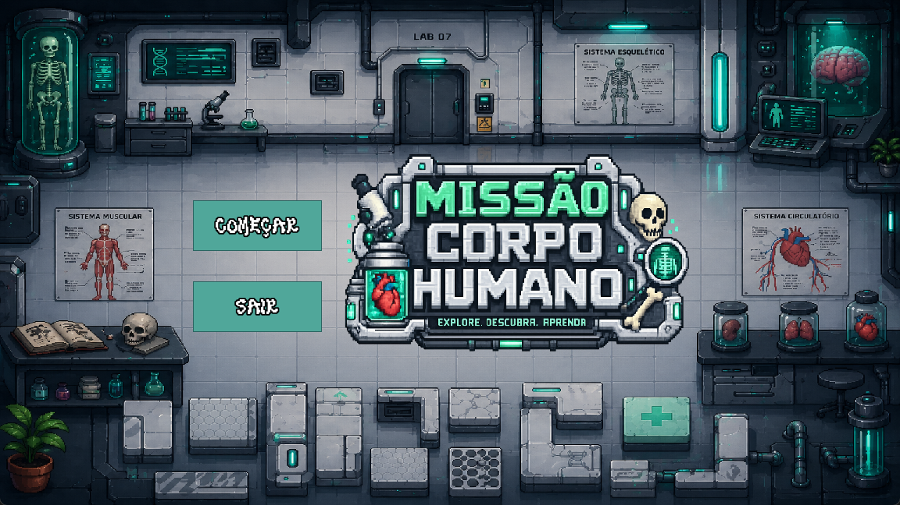
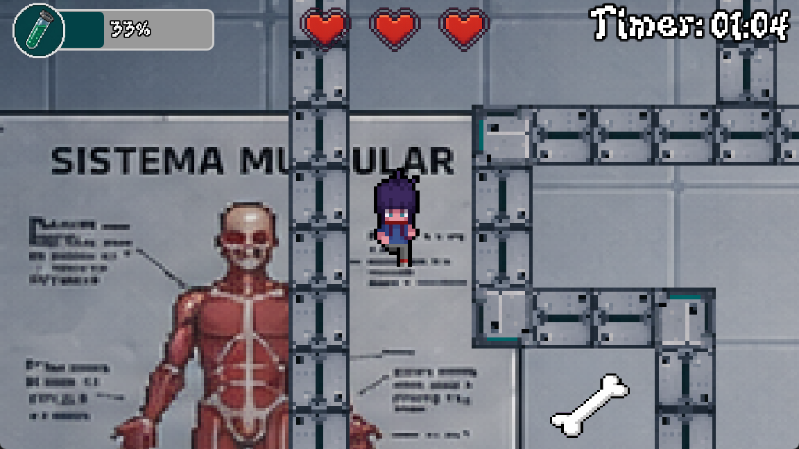
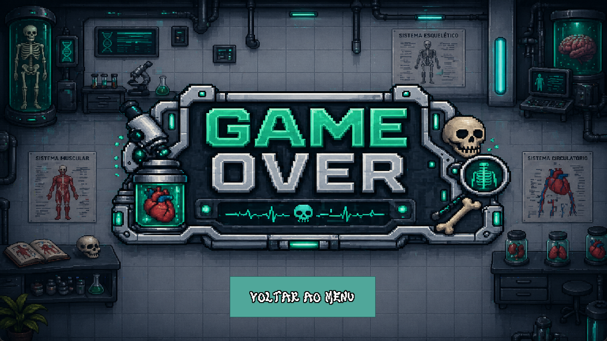

<div align="center">



### Jogo educativo 2D desenvolvido em Godot Engine 4.6
### 2D educational game built with Godot Engine 4.6

**[🇧🇷 Português](#-português)** • **[🇺🇸 English](#-english)**

</div>

---

## 🇧🇷 Português

## 🎓 Contexto acadêmico

Este projeto foi desenvolvido como **trabalho da disciplina T166 – Experimentação de Protótipos**, na **Universidade de Fortaleza (UNIFOR)**, sob orientação da Prof.ª Ma. Karoline Rodrigues Lima. O jogo foi apresentado no **Tech Day** da UNIFOR, como atividade de extensão universitária em parceria com a Escola Yolanda Queiroz, com o objetivo de ensinar os sistemas do corpo humano para alunos do 4º ano do Ensino Fundamental de forma lúdica e interativa.

## 🧠 Sobre o jogo

Você controla um personagem que explora um laboratório e precisa coletar itens espalhados pelo mapa. Cada item representa um **sistema do corpo humano**:

| Item | Sistema |
|---|---|
| 🍎 Maçã | Sistema Digestório |
| 🩸 Gota de sangue | Sistema Circulatório |
| ⚡ Raio | Sistema Nervoso |
| 🦴 Osso | Sistema Esquelético |
| 🫧 Bolha | Sistema Respiratório |
| 🏋️ Haltere | Sistema Muscular |
| 👁️ Olho | Sistema Sensorial |
| 🛡️ Escudo | Sistema Imunológico |

Ao tocar em um item, uma **pergunta de múltipla escolha** sobre aquele sistema aparece. O jogador tem até 2 tentativas para acertar; ao responder corretamente, o item é coletado e uma explicação educativa é exibida na tela.

### Objetivo e desafio

- Colete pelo menos **6 dos 8 itens** disponíveis no mapa.
- Você tem **2 minutos** (120s) para completar a missão.
- Inimigos patrulham o mapa e devem ser evitados.
- Ao final, uma tela de **Vitória** ou **Game Over** é exibida conforme o desempenho.

## 🖼️ Imagens do jogo

<div align="center">
<table>
<tr>
<td align="center"><br/><sub>Jogatina — laboratório, HUD e coleta de itens</sub></td>
<td align="center"><br/><sub>Tela de Game Over</sub></td>
</tr>
</table>
</div>

*Capturas feitas diretamente do jogo em execução (Godot 4.6, modo debug).*

## 🕹️ Controles

| Ação | Tecla |
|---|---|
| Mover | Setas direcionais / WASD |

## 🛠️ Tecnologias

- **Engine:** Godot 4.6 (GDScript)
- **Arte:** sprites pixel art (personagem, itens, inimigos, tileset)
- **Áudio:** efeitos sonoros e trilha em 8-bit
- **Dados:** perguntas armazenadas em `perguntas.json`, carregadas dinamicamente por sistema

## 📂 Estrutura do projeto

Todo o projeto Godot fica dentro da pasta [`MissaoCorpoHumano/`](MissaoCorpoHumano), para que baixar o repositório baixe um único pacote pronto para abrir — em vez de arquivos soltos espalhados pela raiz.

```
missao-corpo-humano/
├── README.md
├── screenshots/                     # Imagens usadas neste README
└── MissaoCorpoHumano/                # Projeto Godot completo (abra esta pasta no Godot)
    ├── project.godot
    ├── main.tscn / main.gd           # Cena principal do jogo (mapa, spawns, HUD)
    ├── QuestionManager.gd            # Autoload responsável pelo estado do jogo, quiz e timer
    ├── quiz_ui.tscn / quiz_ui.gd     # Interface do quiz (perguntas e alternativas)
    ├── item.tscn / item.gd           # Comportamento dos itens colecionáveis
    ├── enemy*.tscn / enemy*.gd       # Inimigos com rotas de patrulha
    ├── control.tscn / control.gd     # Tela de controles/instruções
    ├── Tutorial.tscn / tutorial.gd   # Tutorial inicial
    ├── progresso.tscn / progresso.gd # Barra de progresso e timer visual
    ├── transition.tscn/.gdshader     # Transições de cena (shader)
    ├── perguntas.json                # Banco de perguntas por sistema do corpo humano
    ├── Cenas/                        # Player, menu, vitória e game over
    ├── Missao Corpo Humano/          # Assets próprios (sprites, tileset, áudios)
    └── Caio coisas/                  # Assets adicionais (fontes, UI, sons, sprites de inimigos)
```

## ▶️ Como rodar

1. Instale o [Godot Engine 4.6](https://godotengine.org/download) ou superior.
2. Clone este repositório (ou baixe o ZIP em *Code → Download ZIP*):
   ```bash
   git clone https://github.com/CaioPortela17/missao-corpo-humano.git
   ```
3. Abra o Godot, clique em **Importar**, e selecione a pasta **`MissaoCorpoHumano`** (é ela que contém o `project.godot`).
4. Pressione **F5** (ou o botão de play) para rodar o jogo.

## ✍️ Desenvolvedor

Desenvolvido por **Caio Portela** ([GitHub](https://github.com/CaioPortela17)) como trabalho acadêmico da disciplina T166 (UNIFOR).

---

## 🇺🇸 English

## 🎓 Academic context

This project was developed as **coursework for the T166 – Prototype Experimentation** class at the **University of Fortaleza (UNIFOR)**, under the guidance of Professor Karoline Rodrigues Lima, M.Sc. The game was presented at UNIFOR's **Tech Day** as a university extension activity in partnership with Yolanda Queiroz Elementary School, aiming to teach 4th-grade students about the human body's systems in a fun, interactive way.

## 🧠 About the game

You control a character exploring a laboratory, collecting items scattered across the map. Each item represents a **human body system**:

| Item | System |
|---|---|
| 🍎 Apple | Digestive System |
| 🩸 Blood drop | Circulatory System |
| ⚡ Lightning bolt | Nervous System |
| 🦴 Bone | Skeletal System |
| 🫧 Bubble | Respiratory System |
| 🏋️ Dumbbell | Muscular System |
| 👁️ Eye | Sensory System |
| 🛡️ Shield | Immune System |

Touching an item triggers a **multiple-choice question** about that system. The player has up to 2 attempts to answer correctly; a correct answer collects the item and displays an educational explanation on screen.

### Goal and challenge

- Collect at least **6 out of the 8 items** available on the map.
- You have **2 minutes** (120s) to complete the mission.
- Enemies patrol the map and must be avoided.
- A **Victory** or **Game Over** screen appears at the end, depending on performance.

## 🖼️ Game screenshots

<div align="center">
<table>
<tr>
<td align="center"><br/><sub>Gameplay — laboratory, HUD and item collecting</sub></td>
<td align="center"><br/><sub>Game Over screen</sub></td>
</tr>
</table>
</div>

*Screenshots captured directly from the running game (Godot 4.6, debug mode).*

## 🕹️ Controls

| Action | Key |
|---|---|
| Move | Arrow keys / WASD |

## 🛠️ Tech stack

- **Engine:** Godot 4.6 (GDScript)
- **Art:** pixel art sprites (character, items, enemies, tileset)
- **Audio:** 8-bit sound effects and soundtrack
- **Data:** questions stored in `perguntas.json`, loaded dynamically per system

## 📂 Project structure

The whole Godot project lives inside the [`MissaoCorpoHumano/`](MissaoCorpoHumano) folder, so downloading the repository gets you a single, ready-to-open package instead of loose files scattered at the root.

```
missao-corpo-humano/
├── README.md
├── screenshots/                     # Images used in this README
└── MissaoCorpoHumano/                # Full Godot project (open this folder in Godot)
    ├── project.godot
    ├── main.tscn / main.gd           # Main game scene (map, spawns, HUD)
    ├── QuestionManager.gd            # Autoload responsible for game state, quiz and timer
    ├── quiz_ui.tscn / quiz_ui.gd     # Quiz interface (questions and answer options)
    ├── item.tscn / item.gd           # Collectible item behavior
    ├── enemy*.tscn / enemy*.gd       # Enemies with patrol routes
    ├── control.tscn / control.gd     # Controls/instructions screen
    ├── Tutorial.tscn / tutorial.gd   # Opening tutorial
    ├── progresso.tscn / progresso.gd # Progress bar and visual timer
    ├── transition.tscn/.gdshader     # Scene transitions (shader)
    ├── perguntas.json                # Question bank per human body system
    ├── Cenas/                        # Player, menu, victory and game over scenes
    ├── Missao Corpo Humano/          # Original assets (sprites, tileset, audio)
    └── Caio coisas/                  # Additional assets (fonts, UI, sounds, enemy sprites)
```

## ▶️ How to run

1. Install [Godot Engine 4.6](https://godotengine.org/download) or later.
2. Clone this repository (or download the ZIP via *Code → Download ZIP*):
   ```bash
   git clone https://github.com/CaioPortela17/missao-corpo-humano.git
   ```
3. Open Godot, click **Import**, and select the **`MissaoCorpoHumano`** folder (it's the one containing `project.godot`).
4. Press **F5** (or the play button) to run the game.

## ✍️ Developer

Developed by **Caio Portela** ([GitHub](https://github.com/CaioPortela17)) as academic coursework for the T166 class (UNIFOR).
